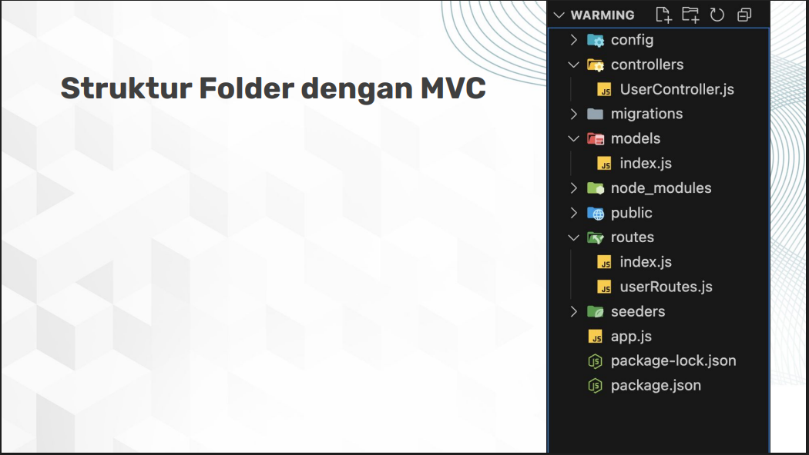

# BACKEND KOSKITA

Backend service untuk aplikasi KosKita.

## Daftar Fitur

1. **Autentikasi Pengguna**
   - Registrasi akun baru
   - Login & logout
   - Manajemen profil pengguna

2. **Reservasi Kamar**
   - Booking/sewa kamar kos
   - Lihat riwayat dan detail penyewaan

3. **Manajemen Data Kos (Admin)**
   - Tambah, lihat, ubah, dan hapus data kos (CRUD)
   - Pencarian kos berdasarkan kriteria tertentu

4. **Manajemen Kamar (Admin)**
   - Otomatisasi pembuatan kamar saat kos dibuat
   - Lihat daftar kamar dan statusnya

5. **Manajemen Fasilitas Kos (Admin)**
   - Tambah, lihat, ubah, dan hapus fasilitas kos

6. **Manajemen User (Admin)**
   - Lihat dan hapus data user

7. **Dokumentasi API**
   - Swagger UI di endpoint `/api-docs`

## Teknologi

- Node.js
- Express.js
- PostgreSQL
- Sequelieze
- Simple JWT Authentication

## Instalasi

```bash
git clone https://github.com/danilardi/backend-koskita.git
cd backend-koskita
npm install
```

## Atur Config DB

ubah nilai pada config/config.json sesuai dengan db yang dimiliki

## Migrasi DB

```bash
npx sequelize db:migrate
```

## Buat .env

```bash
SALT_ROUNDS=[int_bebas]
JWT_SECRET="[string_bebas]"
```

hapus [ ]

## Menjalankan Server

```bash
npm run dev
```

Server berjalan di `http://localhost:3000`

# CARA MEMBUAT DARI AWAL

### 1. Init proyek express

https://www.rakamin.com/dashboard/my-class/3417/module/16379/session/106810

Halaman 18

### 2. Atur Struktur Folder dengan MVC




### 3. Buat integrasi dengan DB

https://www.rakamin.com/dashboard/my-class/3417/module/16379/session/106812

halaman 6

### 4. Tambahkan middleware jika dibutuhkkan

Error handling, logging : https://www.rakamin.com/dashboard/my-class/3417/module/16590/session/106944

Authentication & Authorization : https://www.rakamin.com/dashboard/my-class/3417/module/16590/session/106945

### 5. Membuat swagger

https://www.rakamin.com/dashboard/my-class/3417/module/16590/session/106946

contoh ada di tiap file controllers